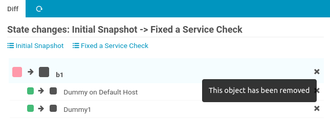

IDO Status Snapshots
====================

This [Icinga](https://icinga.com/) module allows taking multiple Snapshots of
current Host and Service Monitoring Status in your Icinga IDO database. It's
main purpose is being a simplistic tool allowing to compare system health across
two points in time.

The larger your setup, the more this might become helpful:

* when rolling out changes or upgrades on a larger scale
* when running Disaster Recovery tests
* before, during and after Migration processes

In addition to manual Snapshots, this module can be configured to take a Snapshot
before every [Icinga Director](https://github.com/Icinga/icingaweb2-module-director#readme)
Deployment.

Sounds promising? Then read on!

Usage
-----

### Menu

Once [installed](#Installation) and [configured](#Configuration), you'll find
this module in your Icinga Web 2 **History** menu section:


### Create Snapshots

Head on and create your very first Snapshot. Please give your Snapshots
meaningful names, this makes your life easier later on: 


### Inspect Snapshots

Every snapshot contains your Icinga Service and Host object names, and their
current Monitoring Status. In case an object has a problem, the snapshot also
stores whether this problem has been acknowledged or is covered by a downtime.
In case it is a Service, it's Host state also has an influence on whether the
problem is considered being "handled".

You can select any snapshot and navigate through its objects. A click on any
object forwards you to the related Monitoring Details page:


### Compare Snapshots

This is the main essential feature provided by this module. When visiting a
Snapshot, click **Diff**...


...and choose one of your other Snapshots:


It doesn't matter whether you choose the older or the recent one first, the
Diff will always be calculated and shown in the correct chronological order.
Objects that have been removed (or created) between two Snapshots will also
be shown:


In case there are no Differences, you're being told:


### Status Details: handled problems and related changes

Colors and Icons are giving more details about the related Monitoring State.

#### A problem can be Acknowledged


#### A Downtime might have been configured and activated


#### Service Problems are muted, when their Host is down


#### Host recovery might then trigger new alarms

This example shows a diff, where Services formerly been muted by a Host problem
start alarming again, after the Host recovers:


#### Removed objects are visible and marked as such



### Delete outdated Snapshots

Once you no longer need older Snapshots, please delete them:


This saves disk space and computing power.

Installation
------------

### Requirements

* Icinga Web 2 (&gt; 2.8)
* PHP (&gt;= 7.1 or 8.x, 64bit only)
* MySQL (&gt;= 5.6) or MariaDB (&gt;= 5.5.3)
* The following Icinga modules must be installed and enabled:
    * [incubator](https://github.com/Icinga/icingaweb2-module-incubator) (>=0.12)
    * If you are using Icinga Web &lt; 2.9.0, the following modules are also required
        * [ipl](https://github.com/Icinga/icingaweb2-module-ipl) (>=0.5.0)
        * [reactbundle](https://github.com/Icinga/icingaweb2-module-reactbundle) (>=0.7.0)

### Module Installation

```shell
# You can customize these settings, but we suggest to stick with our defaults:
MODULE_VERSION="1.1.1"
ICINGAWEB_MODULEPATH="/usr/share/icingaweb2/modules"
REPO_URL="https://github.com/Thomas-Gelf/icingaweb2-module-idosnap"
TARGET_DIR="${ICINGAWEB_MODULEPATH}/idosnap"
URL="${REPO_URL}/archive/refs/tags/v${MODULE_VERSION}.tar.gz"

install -d -m 0755 "${TARGET_DIR}"
test -d "${TARGET_DIR}_TMP" && rm -rf "${TARGET_DIR}_TMP"
test -d "${TARGET_DIR}_BACKUP" && rm -rf "${TARGET_DIR}_BACKUP"
install -d -o root -g root -m 0755 "${TARGET_DIR}_TMP"
wget -q -O - "$URL" | tar xfz - -C "${TARGET_DIR}_TMP" --strip-components 1 \
  && mv "${TARGET_DIR}" "${TARGET_DIR}_BACKUP" \
  && mv "${TARGET_DIR}_TMP" "${TARGET_DIR}" \
  && rm -rf "${TARGET_DIR}_BACKUP"
```

### Create an empty database on MariaDB (or MySQL)

This module requires a MariaDB or MySQL database:

    mysql -e "CREATE DATABASE idosnap CHARACTER SET 'utf8mb4' COLLATE utf8mb4_bin;
       CREATE USER idosnap@localhost IDENTIFIED BY 'some-password';
       GRANT ALL ON idosnap.* TO idosnap@localhost;"

HINT: You should replace `some-password` with a secure custom password.

### Apply the Database Schema

Our schema is provided in `schema/mysql.sql`, applying this is usually as simple
as running:

    mysql idosnap < "$TARGET_DIR/schema/mysql.sql"

Configuration
-------------

### Configure a DB Resource in Icinga Web 2

In your web frontend please go to `Configuration / Application / Resources`
and create a new database resource pointing to your newly created database.
Please make sure that you choose `utf8mb4` as an encoding.

### Refer the configured DB resource

Now you're ready to populate `/etc/icingaweb2/modules/idosnap/config.ini`,
please reference your newly configured DB resource:

```ini
[db]
resource = "IDO Snap"
```

### Icinga Director Integration

In case you want to take a Snapshot before every Director Deployment, the
following settings are available:

```ini
[director]
snap_before_deployment = yes
; max_snapshots = 30
```

Automated Snapshots are disabled by default. Only the most recent `max_snapshots`
Director-related Snapshots are preserved, older ones are purged. This does not
affect your manual Snapshots, they'll persist unless you delete them.

### When something goes wrong

Don't worry, when something goes wrong you're usually presented meaningful
error messages:

#### No DB configured


#### No such resource


Read carefully, they usually point you to the right direction.

Changes
-------

### v1.1.2

* FIX: Director snapshot configuration cleanup has been ignored (#4)

### v1.1.1

* FIX: respect Director snapshot amount configuration (#3)

### v1.1.0

* FIX: in a Diff, object names where missing or incorrect for newly created objects
* FEATURE: Director Deployment Hook for automated Snapshots (#1)

### v1.0.0

First release
